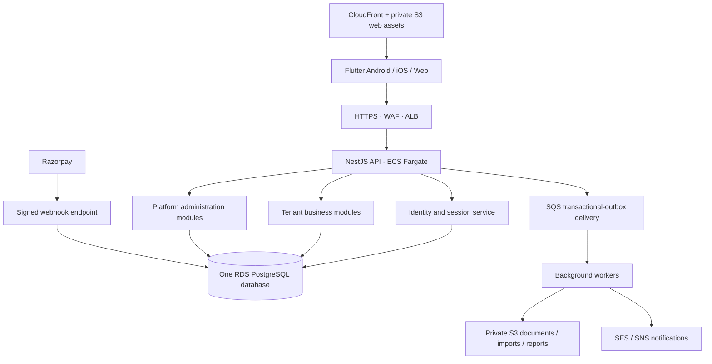
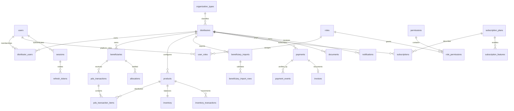

# PDS Distributor SaaS — architecture and implementation contract

Status: architecture approved for implementation by the development request; Phase 1–2 foundation is the first deliverable. The existing web/Flutter tracker is a reference and is not the SaaS backend. No production AWS resources or paid gateway operations are created by this foundation.

## 1. System architecture

Start as a modular NestJS/TypeScript application, not premature microservices. Android, iOS and web use one new Flutter application, one versioned HTTPS API and one PostgreSQL database per environment. Development, staging and production have separate accounts/resources/databases; there are never separate databases for each client platform.



Boundaries: identity; distributor/account profiles; beneficiary/import; products/inventory; allocation/distribution; billing; notifications/documents; platform administration. Modules exchange typed commands and IDs. Only a module owns writes to its tables. Database transactions create both the business change and its audit/outbox event.

## 2. Entity relationships and schema

The executable foundation and forward schema are in `database/001_schema.sql`. UUIDs are internal keys; sequences generate immutable human identifiers such as `DIST-000001` and `BEN-000001`. Gaps are acceptable; never calculate identifiers with MAX()+1. Every operational relationship includes the tenant in its foreign key, so a foreign-tenant beneficiary cannot be attached to a transaction even when its UUID is known.



Data domains:

| Domain | Tables | Key rules |
|---|---|---|
| Identity | users, roles, permissions, role_permissions, user_roles, sessions, refresh_tokens, otp_challenges, pending_registrations, rate_limits | Password hashes only; refresh token and OTP digests only; explicit verified contact fields; revoked sessions invalidate existing access JWTs. |
| Platform | organization_types, distributors, distributor_users, subscription_plans, subscription_features, subscriptions, payments, payment_events, invoices, system_settings, platform_audit_logs | Super admin can inspect profile/billing; no beneficiary joins. Public organization type catalog plus custom label; PACS code only for PACS. |
| Tenant | beneficiaries, beneficiary_imports, beneficiary_import_rows, products, allocations, inventory, inventory_transactions, pds_transactions, pds_transaction_items, documents, notifications, audit_logs, idempotency_keys, outbox_events | Tenant column, composite foreign keys, forced RLS, indexed tenant/month queries; immutable distribution and movement records. |

Amounts use integer paise; quantities use `numeric(14,3)`, never binary floats. Store timestamps in UTC; use the distributor's configured IANA time zone (default Asia/Kolkata) for business-day reports. Month keys are a first-of-month SQL date. Store plan price/features/limits as immutable snapshots on orders/subscriptions so editing a plan cannot change historic invoices or entitlements.

Custom beneficiary fields live in bounded JSONB, validated against a versioned per-tenant field definition in profile settings. Frequently searched fields remain ordinary indexed columns. Do not use arbitrary JSON as a way to bypass validation.

## 3. Tenant isolation

1. Verify access JWT signature, fixed algorithm, issuer, audience and expiry.
2. Load the session and active user from PostgreSQL on every authenticated request; the session supplies the tenant membership, not a request field.
3. Re-check membership, account status and permissions from database. Suspension takes effect immediately, including previously issued JWTs.
4. The tenant database callback begins a transaction and uses parameterized `set_config('app.distributor_id', tenantId, true)` and `set_config('app.user_id', userId, true)`. The setting is transaction-local; pooled connections cannot retain another tenant's context.
5. Tenant tables use both `ENABLE ROW LEVEL SECURITY` and `FORCE ROW LEVEL SECURITY`; policies apply `USING` and `WITH CHECK` against that context.
6. The API tenant role is **not** a superuser, table owner or BYPASSRLS role. It cannot SET ROLE to the migration/platform roles. RLS does not protect against a privileged migration login; startup and integration tests check grants.
7. The platform-admin connection has no USAGE/SELECT rights on the tenant schema. Platform routes have no path to the tenant repository. Business APIs reject super-admin-only sessions with no tenant membership.
8. API input is strict: `distributor_id`, `user_id`, `role`, account status, subscription/payment status and other server-owned fields cause validation errors when supplied to business mutations.

This also applies to cache keys, exports, search indexes, notification destinations, S3 object paths and idempotency keys. Prefix objects `tenants/<internal-tenant-uuid>/...`; verify ownership before signing URLs. Never authorize a document using the object path alone.

PostgreSQL's owner/BYPASSRLS exceptions are explicit in its [row security documentation](https://www.postgresql.org/docs/current/ddl-rowsecurity.html). Tenant-specific errors return a generic 404 for inaccessible record IDs; avoid leaking another tenant's existence via unique-key details.

## 4. Authentication architecture

Registration accepts organization/contact/address fields, password confirmation, current terms version and explicit acceptance. Passwords use salted scrypt with a per-hash parameter record; allow long passphrases, reject short/oversized inputs, and never log secrets. Register a pending identity and send a cryptographically random six-digit OTP through SES (email) or SNS (mobile). Store only an HMAC digest with purpose/user binding, expiry, consumed time and bounded attempts. Resend invalidates the old challenge. Failed attempts must commit their counter even though the request returns an error.

Successful contact verification consumes the OTP atomically, marks that channel verified, creates the distributor and its admin membership once, generates the distributor code and sets the account to PENDING_APPROVAL. The platform's separately authenticated super admin activates it. Email and mobile login are permitted only for the corresponding verified contact. An email-verified user can verify mobile later. Pending/suspended users receive clear account-status errors after proving their password; no operational session is issued.

Access JWT: 10 minutes, issuer/audience scoped, subject user UUID and session UUID only. Do not trust a role or tenant claim as a substitute for a database lookup. Refresh token: random 256-bit opaque secret, stored only as an HMAC digest, rotated on each use, expires after 30 days. Retain consumed token hashes until expiry to detect replay; replay revokes the whole session family. Reset password and logout-all revoke all sessions. A single logout revokes the current session and tokens.

Flutter mobile stores refresh credentials in OS secure storage and access tokens in memory. Flutter web uses Secure, HttpOnly, SameSite cookies for refresh, CSRF checks for cookie-authenticated mutations, and memory-only access JWTs. Never put long-lived refresh tokens in browser localStorage. The Phase 1 HTTP API supports the cookie path and an explicit native-client path with allowlisted origins; web requests never receive refresh tokens in JSON.

Password-reset requests are enumeration resistant. OTP/delivery errors do not expose whether an account exists. Rate-limit by IP and HMAC-normalized account identifier; share counters across API instances. Production super admins must additionally use MFA/passkeys before launch (hard launch gate; not silently marked implemented by password login).

## 5. API architecture

Prefix `/api/v1`; JSON request/response schemas, strict validation, global error mapping, request IDs, bounded bodies, parameterized SQL, security headers, allowlisted CORS and timeouts. NestJS controllers call services, services own transactions, repositories perform tenant-scoped queries.

| Phase | Routes | Authority |
|---|---|---|
| 1 | auth/register, verify-otp, login, refresh, logout, logout-all, forgot-password, reset-password, me | Identity/session service; no client role or tenant assignment |
| 2 | distributor/me; admin/distributors; admin/distributors/:id/status | Member profile vs platform account administration |
| 3 | beneficiaries CRUD; imports upload/map/preview/confirm/history | Tenant permission + entitlement + RLS |
| 4 | products; inventory/movements; allocations; pds/transactions; receipts | Tenant permission, idempotency, row locks |
| 5 | plans; subscriptions/current; payments/orders; payments/webhook; invoices | Server-side prices, verified gateway event |
| 6–7 | admin plans/payments/subscriptions/audit/settings; reports; notifications | Separate platform/tenant data access |

Later list APIs use cursor pagination, allowlisted sort fields and maximum page sizes. All monetary/distribution mutations require an idempotency key unique within tenant and route plus request-body hash; identical replay returns the original response, changed payload returns 409. Offline Flutter commands store tenant/session identity and command UUID; never upload tenant A's queue after logging in as tenant B.

## 6. Payments and entitlement architecture

Use Razorpay behind a gateway interface so Cashfree/PhonePe can be added later. The backend selects active plan version and price from its database; the client supplies only a plan ID. Create a local pending order before calling the gateway with a stable receipt/idempotency reference. Store the gateway order ID with a unique constraint.

The webhook receives raw bytes; validate HMAC signature using the webhook secret before parsing/processing, then insert the gateway event ID with a uniqueness constraint. Confirm order, amount, currency, capture status and account against server records (and gateway API where required). A Flutter checkout-success message only requests verification; it cannot activate a subscription. Process payment, subscription period, invoice and notification-outbox insertion in one transaction. Duplicate/out-of-order events cannot extend a subscription twice. Refunds use a controlled gateway workflow; a platform admin cannot edit payment status arbitrarily.

Subscription evaluation uses server time on every protected mutation and on queued-job execution. Expiry preserves read/export/renewal access to existing records while blocking features outside the effective plan. Staff, beneficiary and storage limits are checked transactionally with tenant-level locks to prevent concurrent requests exceeding the quota. Never trust limits cached in Flutter.

## 7. Flutter application

Create a new `clients/flutter/` project with Material 3, Riverpod, GoRouter and feature modules. It will not reuse the old `flutter_app` GitHub sync code.

```text
lib/
  main.dart
  app.dart
  core/
    network/   # HTTPS client, refresh single-flight, request IDs
    auth/      # session, verified membership, permission state
    theme/     # Material 3, typography, accessible colors
    storage/   # secure mobile tokens; separate tenant offline caches
    errors/
    utils/
  features/
    auth/{data,domain,presentation}/
    dashboard/{data,domain,presentation}/
    distributor_profile/{data,domain,presentation}/
    beneficiaries/{data,domain,presentation}/
    beneficiary_import/{data,domain,presentation}/
    pds/{data,domain,presentation}/
    inventory/{data,domain,presentation}/
    products/{data,domain,presentation}/
    staff/{data,domain,presentation}/
    reports/{data,domain,presentation}/
    subscription/{data,domain,presentation}/
    payments/{data,domain,presentation}/
    notifications/{data,domain,presentation}/
    settings/{data,domain,presentation}/
  admin/{dashboard,distributors,subscriptions,payments,plans,audit,settings}/
  shared/{widgets,forms,tables,charts}/
```

Public routes: login/register/forgot-password/reset-password/pricing. Tenant routes: dashboard/profile/beneficiaries/import/pds/inventory/products/staff/reports/subscription/payments/settings. Admin routes: admin/distributors/subscriptions/payments/plans/audit-logs/settings. GoRouter redirects improve UX; backend authorization remains authoritative.

Mobile: SafeArea, 48px controls, bottom navigation/drawer, wrapping headings and scrollable forms. Desktop: sidebar, top navigation and paginated tables. Honor text scaling, keyboard navigation, screen readers and Hindi labels. Conditional PACS fields appear only when the selected organization type requires them; independent organizations have no PACS requirement.

## 8. Platform administration

The admin dashboard reports distributor/account/subscription/payment aggregates only. It never queries beneficiaries or PDS item rows. Usage metrics are pre-aggregated counts/bytes, without names/card numbers or transaction content. Distributor detail tabs expose profile, account, subscription, billing, login/activity, aggregate usage and platform audit history.

Profile/account changes require a reason and append an audit event in the same transaction. No general-purpose SQL console or tenant impersonation endpoint. Temporary support access is a future dedicated feature: tenant approval plus explicitly privileged support operator, reason, narrow scopes, short expiry, revocable grant and full read/action audit. Do not implement an implicit super-admin bypass now.

## 9. AWS production architecture

Default region: ap-south-1 (Mumbai), subject to the owner's final deployment choice. Use separate dev/staging/prod accounts or tightly separated VPC/resource/IAM boundaries. ECS Fargate services and RDS PostgreSQL run in private subnets across at least two AZs. Only the ALB is public; RDS accepts traffic only from API/worker security groups. Use RDS Proxy or measured pg connection limits to protect the database when scaling ECS.

CloudFront serves a private S3 Flutter Web origin through Origin Access Control. API TLS uses ACM and ALB; Route 53 maps approved domains. Public asset and private tenant-document buckets are separate with Block Public Access, encryption and lifecycle rules. Uploads use presigned POST constraints, random object names, size/type allowlists, quarantine and malware scanning before availability. XLSX import must reject formulas/macros, zip bombs, oversized row counts and invalid headers; inspect contents, not the extension alone.

Use ECS task IAM roles, Secrets Manager, KMS and scoped permissions. Flutter contains only public API configuration, never AWS/database/payment/JWT secrets. CI uses GitHub OIDC to assume narrowly scoped deployment roles, not stored AWS access keys. Images run non-root; deploy migrations as a separate, controlled task. Use backwards-compatible expand/contract migrations and staged rolling deployment.

CloudWatch structured logs omit passwords, OTPs, tokens, request bodies and beneficiary PII. Alert on error rates, auth failures, rejected signatures, queue age, database pressure, backup failures and unusual platform actions. Audit records are append-only to application roles and periodically exported to retention-protected S3.

Configure encrypted RDS automated backups, 35-day retention where supported, PITR, deletion protection and a final snapshot on approved deletion. Run quarterly restore drills and record observed RPO/RTO; initial targets are RPO <= 5 minutes and RTO <= 4 hours, not claims of verified service performance. [RDS backup documentation](https://docs.aws.amazon.com/AmazonRDS/latest/UserGuide/USER_WorkingWithAutomatedBackups.html).

## 10. Risks and controls before implementation

| Risk | Required prevention and acceptance test |
|---|---|
| Cross-tenant leakage | Database RLS + composite FKs + transaction-local identity + session membership; real-Postgres tests with two tenants and guessed IDs; admin DB role denied tenant SELECT. |
| Payment fraud | Raw-body signature validation, gateway verification, exact amount/currency match, event deduplication; fake callback and replay tests. |
| Duplicate imports | Tenant+card uniqueness, upload digest, preview ownership/version, import confirmation idempotency; concurrent import tests. |
| Duplicate distributions | Tenant-scoped command UUID, allocation-level uniqueness/locking, atomic stock and receipt transaction; concurrent/offline replay tests. |
| Unauthorized admin access | Database-verified platform role, MFA launch gate, no tenant schema grants, audited controlled operations; role-forgery and default-deny tests. |
| Expired subscription bypass | Backend effective-entitlement checks on writes/workers, server time, locked limits; stale-JWT and concurrent-limit tests. |
| Data loss | Transactional outbox, immutable movements, PITR, S3 versioning, tested restore, no delete-on-expiry. |
| API abuse | Shared rate counters, bounded uploads/pagination, WAF, timeouts, OTP budgets, per-tenant quotas. |
| Credential theft | scrypt password hashes, short JWT lifetime, hashed rotating refresh tokens, reuse detection, secure cookies/OS storage, Secrets Manager, log redaction. |

## Delivery gates

Phase 1–2: auth endpoints, OTP/session lifecycle, verified organization provisioning, profile/account roles, migrations, RLS and executable isolation tests. This phase is a foundation, not the complete paid platform.

Phase 3: beneficiary CRUD and staged CSV/XLSX import, ownership and deduplication tests. Phase 4: configurable products, allocations, inventory and immutable distribution/receipt workflows. Phase 5: versioned plans, gateway sandbox integration, webhook/invoice/entitlement tests. Phase 6: platform admin screens/actions with MFA. Phase 7: tenant reports, notifications and aggregate admin analytics. Phase 8: AWS infrastructure, load/security testing, restore drill, observability and signed mobile releases.

No production-readiness claim is made until the gates pass. Missing external prerequisites: AWS account/region/domain approval, SES identity/SNS sender setup, payment merchant sandbox/live credentials, production terms/privacy text, super-admin MFA enrollment, signing assets, and a PostgreSQL environment for isolation/integration tests. These do not block writing or locally checking the foundation.
